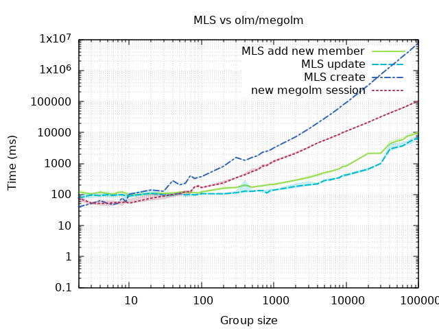

[](https://matrix.org){: .logo} _Last updated: 2022-11-16_

```
                                   __   __ _    ____               _   ___ 
  __ _ _ __ ___   __      _____   |  \ /  | |  /   _|   _   _  ___| |_/ _ \
 / _` | '__/ _ \  \ \ /\ / / _ \  |   V   | |  \_ (_   | | | |/ _ \ __\// /
| (_| | | |  __/   \ V  V /  __/  | |\_/| | |____)  \  | |_| |  __/ |_  \/ 
 \__,_|_|  \___|    \_/\_/ \___|  |_|   |_|____|____/   \__, |\___|\__| () 
                                                         |___/             
```

# Not Yet.

[Messaging Layer Security (MLS)](https://messaginglayersecurity.rocks/) is an
upcoming IETF standard for end-to-end encryption in messaging systems.  We are
investigating bringing MLS to Matrix.

In most cases, MLS has better performance in large groups than Olm/Megolm.  The
graph below shows a comparison[¹](#fn1) between some MLS and Olm/Megolm operations.



The graph gives a simplified comparison, but gives an idea of their relative
performance.  In most cases, MLS is faster than Olm/Megolm.  But one case in
which MLS can be much slower when adding a large number of users to a group at
a time.  It is expected that this would not be a common occurrence.

However, integrating MLS into Matrix is not a simple task.  One of the biggest
hurdles is that MLS assumes that epochs (essentially, the state of an MLS tree
in between updates to the tree) have a linear ordering.  However, Matrix being
a decentralised system with no central authority, it is difficult to enforce a
linear ordering.  Thus we must either determine a way to do so, or work around
this limitation.

In addition, we need to investigate how other Matrix features, such as key
backups, interact with MLS.

# Tasks

(tasks are not necessarily in order)

## Initial investigation
- ✅ create trial implementation of MLS
  - [source code](https://gitlab.matrix.org/matrix-org/mls-ts/)
- ✅ investigate non-decentralised MLS on Matrix
- ✅ investigate and test strategies for decentralised MLS
  - [ideas](https://gitlab.matrix.org/matrix-org/mls-ts/-/blob/decentralised2/decentralised.org)
  - [source
    code](https://gitlab.matrix.org/matrix-org/mls-ts/-/tree/decentralised2)
- ✅ investigate backfilling commit messages
- ✅ performance comparison between (non-decentralised) MLS and Olm/Megolm
  - [source code](https://gitlab.matrix.org/uhoreg/mls-comparison)
  - [initial comparison](https://gitlab.matrix.org/uhoreg/mls-comparison/-/wikis/home)

## Implementation
- ✅ investigate suitability of [OpenMLS](https://github.com/openmls/openmls)
  (Rust implementation of MLS) as a base for decentralised MLS
- ✅ create a library for decentralised MLS: [matrix-dmls](https://gitlab.matrix.org/uhoreg/matrix-dmls)
- ⏳ trial implementation in a client
- ☐ investigate decryption of historical messages
  - re-decryption of old messages
  - key sharing
  - key backup
- ☐ investigate and implement external commits (ability to send an encrypted
  message before a current member has added you to the MLS tree)
- ☐ integrate decentralised MLS into Rust crypto crate
- ☐ write bindings for other languages
- ☐ fully support MLS in clients

## Documentation
- ☐ write and finalise MSCs for MLS over Matrix
- ☐ write MLS implementation guide for clients

# Resources

- [MSC2883](https://github.com/matrix-org/matrix-spec-proposals/pull/2883):
  Matrix-flavoured MLS - (preliminary) description of how to do MLS over Matrix
- [Decentralised
  MLS](https://gitlab.matrix.org/matrix-org/mls-ts/-/blob/decentralised2/decentralised.org) -
  an investigation into avoiding the requirement for a linear ordering of MLS epochs

-----

<a name="fn1">¹</a> code for running the comparison is at
<https://gitlab.matrix.org/uhoreg/mls-comparison>. More details on how the
comparison was run is at
<https://gitlab.matrix.org/uhoreg/mls-comparison/-/wikis/home>.
